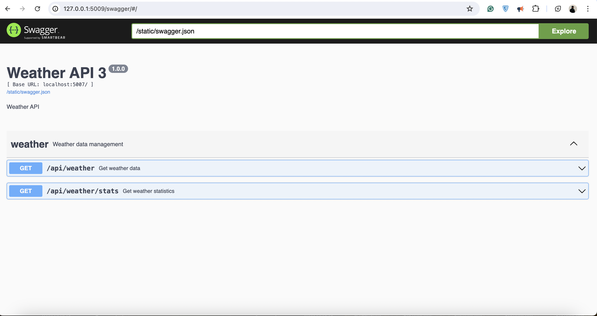
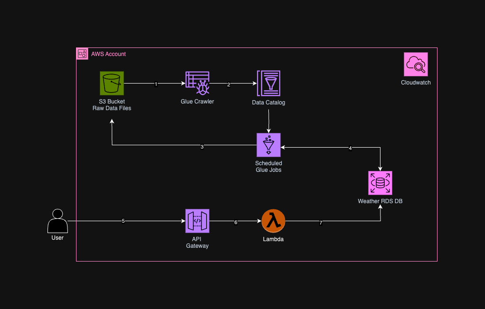

# Weather Data API

An API to retrieve weather data records from January 1, 1985, to December 31, 2014, for weather stations located in Nebraska, Iowa, Illinois, Indiana, and Ohio.

---


## Technologies Used

- Python
- Flask
- Sqlite DB
- Swagger

---


## Local setup

1. Clone the repository:

    ```bash
    git clone <repo_url>
    cd <project_name>
    ```
2. Install the Dependencies 

    ```bash
    pip install -r requirements.txt
    ```
3. Change the permissions of the file run_all.sh to make it executable

    ```bash
    chmod +x ./run_all.sh
    ```
4. Execute the script

    ```bash
    ./run_ all.sh
    ```
5. Navigate to `http://localhost:5000/swagger/` to view the Swagger documentation for the API.


---


## Tables

### `WeatherStation`

The weather_stations table stores information about different weather stations.

* `id`: Integer, Primary Key, Auto-incremented
* `station_name` : String(255), Unique, Not Null


### `WeatherData`

The weather_data table stores daily weather data recorded by the weather stations.

* `id`: Integer, Primary Key, Auto-incremented
* `station_id`: Integer, Foreign Key (weather_stations.id), Not Null
* `date`: Date, Not Null
* `max_temp`: Integer
* `min_temp`: Integer
* `precipitation` : Integer


### `WeatherStatistics`

The weather_statistics table stores aggregated weather data, such as average temperatures and total precipitation for each year.

* `id`: Integer, Primary Key, Auto-incremented
* `station_id`: Integer, Foreign Key (weather_stations.id), Not Null
* `year`: Integer, Not Null
* `avg_max_temp`: Float
* `avg_min_temp`: Float
* `total_precipitation`: Float


---


## API Endpoints

### `/api/weather`

### Request Parameters
* `station_id (optional)`: Filters records by the station ID.
* `start_date (optional)`: Filters records starting from this date (YYYY-MM-DD format).
* `end_date (optional)` : Filters records up to this date (YYYY-MM-DD format).

### Response
* `id`: The unique ID of the record
* `station_id`: The ID of the weather station that recorded the data
* `date`: The date of the record in `YYYY-MM-DD` format
* `max_temp`: The maximum temperature for the day in degrees Celsius
* `min_temp`: The minimum temperature for the day in degrees Celsius
* `precipitation`: The amount of precipitation for the day in centimeters

You can filter the response by date and station ID using the `start_date (optional)`, `end_date (optional)` and `station_id` query parameters respectively.

Example request:

```
GET /api/weather/?station_id=167
```

Example response:

```json
{
    "count": 1649847,
    "next": "http://127.0.0.1:5000//api/weather?station_id=167",
    "previous": null,
    "results": [
        {
            "id": 1,
            "date": "1985-01-01",
            "max_temp": "-3.3",
            "min_temp": "-11.4",
            "precipitation": "0.0",
            "station_id": "167"
        },
        {
            "id": 2,
            "date": "1985-01-02",
            "max_temp": "2.0",
            "min_temp": "-15.3",
            "precipitation": "0.0",
            "station_id": "167"
        },
        ...
    ]
}
```

### `/api/weather/stats`

### Request Parameters
* `station_id (optional)`: Filters statistics by the station ID.
* `year (optional)`: Filters statistics by the year.


### Response
* `id`: The unique ID of the record
* `station_id`: The ID of the weather station
* `year`: The year of the statistics
* `avg_max_temp`: The average maximum temperature for the year in degrees Celsius
* `avg_min_temp`: The average minimum temperature for the year in degrees Celsius
* `total_precipitation`: The total accumulated precipitation for the year in centimeters

You can filter the response by station ID using the `station_id` and `year` query parameter.

Example request:

```
GET /api/weather/stats/?year=1985&station_id=167
```

Example response:

```json
{
    "count": 5010,
    "next": "http://127.0.0.1:5000/api/weather/stats?year=1985&station_id=167",
    "previous": null,
    "results": [
        {
            "id": 1,
            "year": 1985,
            "station_id": "167",
            "avg_max_temp": "17.3",
            "avg_min_temp": "7.3",
            "total_precipitation": "480.1"
        },
        ...
    ]
}
```

---

## API Documentation
This project offers an API for retrieving weather data. The API documentation follows the OpenAPI 3.0 specification and can be accessed through Swagger.

To view the Swagger documentation, start the Flask development server and go to `http://localhost:5000/swagger/`. This will bring up the Swagger UI, where you can interact with the API and review its documentation.


---

## Testing

This project features a set of automated tests to verify its functionality of the api. To execute the tests with the command

```bash
pytest test.py
```


---


## Screen Shots





---

### Future AWS Scope




